<h1  style="text-align: center;"> VintageCarCommunity </h1>
<h3  style="text-align: center;"> Pflichtenheft  </h3>

 

# Use Case Diagramm

![](http://www.plantuml.com/plantuml/svg/XLRDRjms4BxhAQO-EK3NlGT143TrVs07BUAq1b8L1INDIgofaK6Ex5P5doMNFaDEkUsBTSYbH2qtw9u4pNppm_b_vLXP7djJVC4TzWYFkhAAk32uPU01h6uxXaPRh5aFL1Igvi72ZMhHTiemMb1k_Hi1LvgC9-xvwI-oxz3UYsbcuQQVMTPEYYT6RJf5ZOag0Z4IYiBxewWr2BzeOj7zMjdNGz-FfFal-BieHeUrSWXdi-sHMYSIM0rSagBjO1kqTEPrN-x9btHIQlELgWnsX54m12L9NTBMYXI1edLC0ZRo4lZzw7R_ycHqtU7Y0rHZtKNj-2TR5Ub9x1tQNXCyeaLTAHknLpTxUiAb45yFn4FfdJBOHlpTzLjijMEhqUBdf1pQHrrZ4AiqyYpt-v53_g6n53vdwURxlILScyf37AsvtDnjf2UfQ_MW9iqIEIG8cOdGryAeDUir-FO19wrCYrvbUOZ_LdLsmh5rlRBtQxz-yBNHAvzP9AXydDan6XC5FVye7RrcU9fZLyRqKCWFn304vAaIwzMI_XZeDwldU2yUZE89N2gJdpnXfTQws3q8qxWySornzUxM_oIPj_YWhEBHgbJ09QKAMZ__29kRti183RmVA-ns7srmf2IB8SKurslwp-LJuwU2MjVJLLvFkVMXGPkRbtGyASCn6KkD5KNiIhXucQO0F8SNBwJva9gNBuk5B9ZOy06WgJPZWu9OUa8GMMDboA8uF-G_WysldMuQfDysSBuAohF_HuQSdy34B9z0xLzq0XJZTGesXqfmS-Ek-8VpB8jJWYs3ydo9ww6Lp8CJCStAHU0qC4BORyDsReNdS1Q-5grO9EqS0X9t-vefgT4eVhcwirhafj6fliVGzS93GHEyaMxfbK4AvVyus99-j0oniv6GbcbsSNReH4mdY1VVQ8JW2MWdkccqiDrzij3Wo4x89NrdXzq79mEmOOH-zx7r2oHJc3qQ_FDKpt0msagQnXv-9a4HTZrILE9N_jwjsL_lsNJnzONVu-B44-hT1oJnAKrHTBdmJHRunGaVbGRJKK3kovBMm_1-42aIOhG_eTvdmGSshDKA6qsjO8-TJcl06xpJ_gH1Wp8b_R95q0HFQ7ogHU6rOcm7gp44EJqc30mXjPMou3GrkPLiUNXJb-CsQbwuUsP9wsl9xLUITXej-oJdgdsEl3wl92wVkbDRzcKbCrbP3WkJ5JK-Z2NzWP8GerkaLJQoWeWzvGiCMGdwk11klSR1CinpFLCnNnYYuuguHK6GwdeiAGpSjxjFzNshAfImeYPq1yuK_nJ5mNY3pMPz5PxFsdD6R8sC6f-JKMClPzJrrCbOnJenmefgS_9QGyuxseOP86tnZ9wrHywUMo-Zf_BEENb9vcnVLZajtYGvDXsJHJe1XBpCuqFoSGWIUssaoAQICBEhFksPOzuhf6RipNy0)

# Anforderungsspezifikationen

### StR.L.1:

| Abschnitt | Beschreibung |
| --- | --- |
| Name |               Lagerhalter  Konto anlegen                |
| Primärer Akteur |            Lagerhalter             |
| Weitere Akteure |                 ...                     |
| Stakeholder-Ziel(e) |           Konto anlegen, Ort des Einlagerns, Kosten für der Einlagerung, Servicezeiten und Lagerungbedigungen eingeben             |
| Auslösendes Ereignis (Trigger) |                 Lagerhalter möchte sich registerieren                     |
| Beschreibung |            Registrieren von dem Lagerhalter, dazu Ort des Einlagerns, Kosten für die Einlagerung Servicezeiten und Lagerbedigungen (z.B. beheizt, UV-geschutzt, Klimatisiert, 24h Zugang, Wachschutz) eingeben             |
| Beziehung zu anderen Use Cases |            ...           |

| Auslösendes Ereignis | Inhalt |
| --- | --- |
| Auslösendes Ereignis  | Der Lagerhalter möchte sich registrieren |
| Vorbedingung | Der Lagerhalter hat eine gültige E-Mail Adresse|
| Nachbedingung |Der Lagerhalter hat ein Konto erstellt.|
| Hauptszenario |1. Der Lagerhalter klickt auf " registrieren". 2. Das System zeigt die Registrierungsseite an. 3. Der Lagerhalter gibt seine E-Mail-Adresse und sein Passwort ein. 4. Das System verifiziert die Eingaben. Das System legt ein Lagerkonto an. 6. Die Profilseite wird geöffnet. 7. Der Lagerhalter gibt seine Daten ein. 8. Der Lagerhalter drückt auf die Schaltfläche "Speichern".|
| Alternativszenarien |                      |
| Ausnahme szenarien |4a. Die E-Mail wurde bereits registriert. 5. Das System zeigt die Meldung "Ihre E-Mail ist bereits registriert" an.|

### StR.L.2:

| Abschnitt | Beschreibung |
| --- | --- |
| Name |            Einlagerungsservices anbieten           |
| Primärer Akteur |            Lagerhalter             |
| Weitere Akteure |                 ...|
| Stakeholder-Ziel(e) |            Verschiedenen Services für die Einlager, wie Einschweißen anbieten            |
| Auslösendes Ereignis (Trigger) |                 Lagerhalter möchte eine Service anbieten                    |
| Beschreibung |             Die Lagerhalter sollen verschiedene Services für die Einlagerung von Fahrzeugen anbieten können, z.B. Einschweißen des Fahrzeuges in Folie, Glasbox etc.            |
| Beziehung zu anderen Use Cases |            ...       |
 

| Auslösendes Ereignis | Inhalt |
| --- | --- |
| Auslösendes Ereignis  | Der Lagerhalter möchte eine Service anbieten. |
| Vorbedingung | Der Lagerhalter hat ein Konto.|
| Nachbedingung |Der Lagerhalter stellt seine Service zur Verfügung.|
| Hauptszenario |1. Lagerhalter geht auf den "Lagerbereich". 2. Das System zeigt eine Ansicht. 3. Der Lagerhalter klickt auf "Service anbieten". 4. Das System zeigt ein Formular an. 5. Der Lagerhalter gibt einen Servicenamen und die Beschreibung der service ein. 6. Der Lagerhalter bestätigt seine Eingabe. 7. Das System verknüpft die angebotene Dienstleistung mit dem Profil des Lagerhalters.|
| Alternativszenarien |                      |
| Ausnahme szenarien |  ...  |

### StR.L.3: 

| Abschnitt | Beschreibung |
| --- | --- |
| Name |                 Kapazitäten angeben                    |
| Primärer Akteur |            Lagerhalter             |
| Weitere Akteure |                 ...                     |
| Stakeholder-Ziel(e) |            Lagerhalter sollen auch angeben können, wie viele Plätze in welcher Kategorie für Fahrzeuge momentan zur Verfügung stehen             |
| Auslösendes Ereignis (Trigger) |                 Lagerhalter möchte die Anzahl der verfügbaren Plätze angeben                    |
| Beschreibung |            Eingeben der aktuellen Anzahl von Plätzen und iherer Kategorie, die zur Verfügung stehen             |
| Beziehung zu anderen Use Cases |            ...         |

| Auslösendes Ereignis | Inhalt |
| --- | --- |
| Auslösendes Ereignis  | Lagerhalter möchte die Anzahl der verfügbaren Plätze angeben. |
| Vorbedingung | Der Lagerhalter hat ein Konto.|
| Nachbedingung |Kapazitäten sind sichtbar|
| Hauptszenario |1. Lagerhalter geht auf den "Lagerbereich". 2. Das System zeigt eine Ansicht. 3. Lagerhalter klickt auf "Kapazitätsbereich" 4.  Lagerhalter drückt auf Bearbeiten 5. Das System zeigt im Dialog alle Kapazitäten an 6. Der Lagerhalter gibt die Kapazitäten und die Kategorien ein. 7. Der Lagerhalter klickt auf speichern 8. Das System zeigt die Kapazitäten an.|
| Alternativszenarien |                      |
| Ausnahme szenarien |...|

### StR.L.4: 

| Abschnitt | Beschreibung |
| --- | --- |
| Name |                Spezialgebiet angeben |
| Primärer Akteur |            Lagerhalter |
| Weitere Akteure |                 ...                     |
| Stakeholder-Ziel(e) |            Der Lagerhalter gibt an, auf welche Fahrzeugmarken er spezialisiert ist .            |
| Auslösendes Ereignis (Trigger) |                 Der Lagerhalter möchte sein Spezialgebiet angeben |
| Beschreibung |            Der Lagerhalter wählt Fahrzeugmarken, auf sie er spezialisiert ist. Die Auswahlsliste soll auf dem System  vorhalten             |
| Beziehung zu anderen Use Cases |            ...           |

| Auslösendes Ereignis | Inhalt |
| --- | --- |
| Auslösendes Ereignis  | Lagerhalter möchte sein Spezialgebiet angeben |
| Vorbedingung | Lagerhalter hat ein Konto|
| Nachbedingung | Spezialgebiet wird angezeigt |
| Hauptszenario | 1. Lagerhalter geht auf den "Lagerbereich". 2. Das System zeigt eine Ansicht. 3. Der Lagerhalter klickt auf  "Spezialgebiet" 4. Der Lagerhalter klickt auf "Bearbeiten" 5. Das System zeigt eine Liste mit allen Spezialgebieten an 6. Der Lagerhalter wählt aus der Liste aus, auf welche Automarken er spezialisiert ist 7. Der Lagerhalter klickt auf Speichern 8. Das System zeigt die Spezialitäten an. |
| Alternativszenarien | ... |
| Ausnahme szenarien |...|

### StR.L.5: 

| Abschnitt | Beschreibung |
| --- | --- |
| Name |                 Informationen bereitstellen |
| Primärer Akteur |            Lagerhalter             |
| Weitere Akteure |                 ...                     |
| Stakeholder-Ziel(e) |             Informationen über die Fahrbereitschaft des jeweiligen Fahrzeuges zur Verfügung stellen            |
| Auslösendes Ereignis (Trigger) |                 Lagerhalter möchte Informationen über die Fahrbereitschaft  angeben/aktualisieren                   |
| Beschreibung |            aktuelle Informationen über  den Wartungsstand des jeweiligen Fahrzeuges sollen bereitgestellt             |
| Beziehung zu anderen Use Cases |            ...             |

| Auslösendes Ereignis | Inhalt |
| --- | --- |
| Auslösendes Ereignis  | Lagerhalter möchte Informationen über die Fahrbereitschaft angeben/aktuallisieren |
| Vorbedingung | Lagerhalter hat ein Konto |
| Nachbedingung | Fahrbereitschaft wird angezeigt |
| Hauptszenario | 1. Der Lagerhalter Klickt auf den bereich"Fahrzeug" . 2. das System zeigt dem Lagerhalter eine Tabellenansicht samt Informationen über die eingelagerten Auto. 3. Der Lagerhalter wählt ein Auto. 4. Der Lagerhalter drückt auf "Bearbeiten". 5. Das System öffnet einen Dialog zum Bearbeiten. 6. Der Lagerhalter bearbeitet die Fahrbereitschaft. 7. Der Lagerhalter klickt auf "speichern". |
| Alternativszenarien | ... |
| Ausnahme szenarien | ... |

### StR.L.6 :
| Abschnitt | Beschreibung |
| --- | --- |
| Name |                 Reparaturanfragen an Werkstätten einstellen |
| Primärer Akteur |            Lagerhalter             |
| Weitere Akteure |                  Werkstatt                 |
| Stakeholder-Ziel(e) |      Die Lagerhalter können Anfragen zu Reparaturen und Wartungsarbeiten einstellen.      |
| Auslösendes Ereignis (Trigger) |              Knopf drücken                  |
| Beschreibung |             Die Lagerhalter können Anfragen zu Reparaturen und Wartungsarbeiten an registrierte Werkstätten in der Nähe einstellen.            |
| Beziehung zu anderen Use Cases |           ...          |

| Auslösendes Ereignis | Inhalt |
| --- | --- |
| Auslösendes Ereignis  | Der Lagerhalter möchte eine Reparaturanfrage an Werkstatt einstellen |
| Vorbedingung | Lagerhalter hat ein Konto |
| Nachbedingung | Lagerhalter hat die passende Werkstatt |
|gefunden und ein Reparaturanfragen||
|eingestellt ||
| Hauptszenario | 1. Der Lagerhalter klickt auf den  Bereich "Werkstätte" . 2. Der Lagerhalter wählt eine Werkstatt aus. 3. Das System öffnet die Seite von der gewählten Werkstatt. 4. Lagerhalter klickt auf "Reparaturanfrage einstellen". 5. Das System öffnet einen Dialog 6. Lagerhalter schreibt eine Anfrage 7. Der Lagerhalter klickt auf "Absenden". 8. Das System zeigt die Meldung "Reparaturauftrag wurde gestellt" an|
| ||
| Alternativszenarien | ... |
| Ausnahme szenarien | ... |

### StR.L.7:

| Abschnitt | Beschreibung |
| --- | --- |
| Name |                Termin mit Werkstatt vereinbaren                     |
| Primärer Akteur |            Lagerhalter             |
| Weitere Akteure |                 Werkstattt                     |
| Stakeholder-Ziel(e) |             Termine für Reparaturen oder Wartungsarbeiten vereinbaren           |
| Auslösendes Ereignis (Trigger) |                 Button drücken |
| Beschreibung |      Der  Lagerhalter vereinbart einen Termin mit der Werkstatt für Reparaturen oder Wartungsarbeiten. Der Lagerhalter wählt über eine Kalender aus verfügbaren Terminen aus|
| Beziehung zu anderen Use Cases |            ...             |

| Auslösendes Ereignis | Inhalt |
| --- | --- |
| Auslösendes Ereignis  | Button drücken ( Termin mit Werkstatt) |
| Vorbedingung | Lagerhalter hat ein Konto |
| Nachbedingung | Lagerhalter bucht einen Termin bei Werkstatt |
| Hauptszenario | 1. Der Lagerhalter klickt auf den  Bereich "Werkstätte" . 2. Der Lagerhalter wählt eine Werkstatt aus. 3. Der Lagerhalter klickt auf "Termin buchen". 4. Das System öffnet einen Dialog mit einem Kalender, in dem die verfügbaren Termine angezeigt werden. 5. Der Lagerhalter wählt einen Termin aus. 6. Der Lagerhalter klickt auf "Buchen". 7. Das System zeigt eine Meldung an: "Termin wurde erfolgreich gebucht." |
| Alternativszenarien | ... |
| Ausnahme szenarien | ... |

### StR.E.2:
| Abschnitt | Beschreibung |
| --- | --- |
| Name |         Stellplatz suchen                             |
| Primärer Akteur |            Einlagerer |
| Weitere Akteure |                 ...                     |
| Stakeholder-Ziel(e) |            Der Einlagerer sucht einen passenden Stellplatz          |
| Auslösendes Ereignis (Trigger) |                    Suchknopf drücken |
| Beschreibung |       Die Sucherergebnisse sollen die Anschrift des Standortes, zusammen mit dessen Merkmalen (z.B. Wachschutz, Klimatisierung, Anzahl freier Stellplätze etc.) und vor Ort angebotenen Services (Einschweißen, Glasbox) mit den entsprechenden Konditionen an.    |
| Beziehung zu anderen Use Cases |            ...             |

| Auslösendes Ereignis | Inhalt |
| --- | --- |
| Auslösendes Ereignis  | Der Einlagerer sucht einen passenden Stellplatz |
| Vorbedingung | Lagerhalter hat ein Konto |
| Nachbedingung | Der Einlagerer findet einen passenden Stellplatz für sein Fahrzeug |
| Hauptszenario | 1. Der Einlagerer geht in den "Suchbereich". 2. Das System zeigt eine Ansicht an. 3. Der Einlagerer klickt auf "Stellplatz Suchen". 4. Der Einlagerer klickt auf "Stadt" Dropdown Menü. 5. Das System zeigt eine Liste von Städten an. 6. Der Einlagerer wählt eine Stadt aus einer Liste aus. 6. Das System zeigt die verfügbaren Stellplätze an.  7. Der Einlagerer wählt einen Stellplatz aus und drückt auf reservieren. 8. Das System zeigt eine Meldung "Stellplatz wurde erfolgreich reserviert". |
| Alternativszenarien | ... |
| Ausnahme szenarien | ... |

### StR.E.3: 

| Abschnitt | Beschreibung |
| --- | --- |
| Name |                Anfrage an Lagerhalter                    |
| Primärer Akteur |            Einlagerer           |
| Weitere Akteure |                 Lagerhalter                     |
| Stakeholder-Ziel(e) |          Die Einlagerer sollen Anfragen an Lagerhalter stellen können, um die Detailinformationen zum Standort zu erhalten und ein Angebot anfordern zu können.        |
| Auslösendes Ereignis (Trigger) |                 Anfrage an Lagerhalter schicken                   |
| Beschreibung |            Die Einlagerer stellen Anfragen an Lagerhalter, um die Detailinformationen zum Standort zu erhalten          |
| Beziehung zu anderen Use Cases |            ...         |

| Auslösendes Ereignis | Inhalt |
| --- | --- |
| Auslösendes Ereignis  | Einlagerer möchte eine Anfrage an Lagerhalter schicken |
| Vorbedingung | Lagerhalter hat ein Konto |
| Nachbedingung | Der Einlagerer stellt eine Anfrage an Lagerhalter |
| Hauptszenario | 1. Der Einlagerer klickt auf den "Lager" Bereich. 2. Das System zeigt eine Ansicht. 3. Der Einlagerer klickt auf den "Anfrage schicken". 4. Das System öffnet einen Dialog . 5. Der Einlagerer schreibt eine Nachricht an den Lagerhalter. 6. Der Einlagerer klickt auf "Absenden". |
| Alternativszenarien | ... |
| Ausnahme szenarien | ... |

### StR.E.4:
| Abschnitt | Beschreibung |
| --- | --- |
| Name |                 Einlagerungsangebot annehmen/ablehnen                   |
| Primärer Akteur |            Einlagerer            |
| Weitere Akteure |                 ...                     |
| Stakeholder-Ziel(e) |            Die Einlagerer können ein Angebot annehmen oder ablehnen          |
| Auslösendes Ereignis (Trigger) |                 Knopf drücken                    |
| Beschreibung |            Die Einlagerer können ein Angebot annehmen oder ablehnen.        |
| Beziehung zu anderen Use Cases |           In Einlagerungsangebot anfordern inkludiert           |

| Auslösendes Ereignis | Inhalt |
| --- | --- |
| Auslösendes Ereignis  | Einlagerungsangebot annehmen/ablehnen. |
| Vorbedingung | Einlagerer hat ein Konto. |
| Nachbedingung | Die Einlagerer können ein Angebot annehmen oder ablehnen. |
| Hauptszenario | 1. Der Einlagerer klickt auf den "Lager" Bereich. 2. Das System zeigt eine Ansicht. 3. Der Einlagerer klickt auf Angebote. 4. Das System zeigt die verfügbaren Angebote an. 5. Der Einlegerer klickt auf ein "Angebot". 6. Das System zeigt 2 Buttons"Akzeptieren" und "Ablehnen" an.  7. Der Einlagerer klickt einer der beiden Optionen  an. |
| ||
| Alternativszenarien | ... |
| Ausnahme szenarien | ... |

### StR.E.5:
| Abschnitt | Beschreibung |
| --- | --- |
| Name |                Erzatzteile zu Fahrzeug suchen                     |
| Primärer Akteur |            Einlagerer             |
| Weitere Akteure |                 ...                     |
| Stakeholder-Ziel(e) |            Erzatzteile für Fahrzeug suchen             |
| Auslösendes Ereignis (Trigger) |                 Suchworte eingeben und Knopf drücken                   |
| Beschreibung |   Die Einlagerer können Ersatz- und Zubehörteile zu ihrem Fahrzeug suchen, die von Ersatzteilhändlern angeboten werden.      |
| Beziehung zu anderen Use Cases |            ...             |

| Auslösendes Ereignis | Inhalt |
| --- | --- |
| Auslösendes Ereignis  | Einlagerer möchte Erzatzteile zu Fahrzeug suchen |
| Vorbedingung | Einlager hat ein Konto. |
| Nachbedingung | Der Einlager findet Ersatz- und Zubehörteile zu seinem Fahrzeug. |
| Hauptszenario | 1. Der Einlagerer klickt auf den "suche" Bereich. 2. Das System zeigt eine Ansicht. 3. Der Einlagerer klickt auf "Ersatzteil suchen". 4. Das System fragt den Einlagerer nach dem Fahrzeugtyp und der Stadt. 5. Der Einlagerer wählt den Fahrzeugtyp und die Stadt aus. 6. Das System zeigt die verfügbaren Artikel an. 7. Der Einlagerer wählt einen Artikel aus. |
| Alternativszenarien | ... |
| Ausnahme szenarien | ... |

### StR.E.6:
| Abschnitt | Beschreibung |
| --- | --- |
| Name |                 Termin vereinbaren                    |
| Primärer Akteur |            Einlagerer             |
| Weitere Akteure |                   Lagerhalter                 |
| Stakeholder-Ziel(e) |           Einlagerer   macht einen Termin   mit dem Lagerhalter aus           |
| Auslösendes Ereignis (Trigger) |                 Knopf drücken                    |
| Beschreibung |            Die Einlagerer können Termine für das Entgegennehmen und die Rückgabe ihres Fahrzeuges mit dem Lagerhalter vereinbaren            |
| Beziehung zu anderen Use Cases |            ...             |

| Auslösendes Ereignis | Inhalt |
| --- | --- |
| Auslösendes Ereignis  | Einlager drückt auf "Termin vereinbaren" |
| Vorbedingung | Einlagerer hat ein Konto |
| Nachbedingung | Einlagerer macht einen Termine für das Entgegennehmen und die Rückgabe ihres Fahrzeuges mit dem Lagerhalter aus. |
| Hauptszenario | 1. Der Einlagerer klickt auf den "Lager" Bereich. 2. Das System zeigt eine Ansicht. 3. Der  Einlagerer klickt "Termin buchen". 4. Das System öffnet einen Dialog. 5. Der Einlagerer gibt den Zweck des Termins an (z.B Fahrzeug Annehmen oder Rücksenden). 6. Das System zeigt freie Termine an. 7. Der Einlagerer wählt einen Termin aus. 8. Der Einlagerer klickt auf "buchen". 9. Das System zeigt eine Meldung an “Termin wurde erfolgreich gebucht”. |
| Alternativszenarien | ... |
| Ausnahme szenarien | ... |

### StR.E.7:
| Abschnitt | Beschreibung |
| --- | --- |
| Name |                 Zusätzliches Angebot buchen                   |
| Primärer Akteur |            Einlagerer            |
| Weitere Akteure |                  ...             |
| Stakeholder-Ziel(e) |         Zusätzliche  angebotene Service von Lagerhalter buchen         |
| Auslösendes Ereignis (Trigger) |          Einlagerer können die vom Lagerhalter angebotenen Services  buchen            |
| Beschreibung |            Die Einlagerer können zusätzliche Services buchen, die vom Lagerhalter angeboten werden             |
| Beziehung zu anderen Use Cases |       ...        |

| Auslösendes Ereignis | Inhalt |
| --- | --- |
| Auslösendes Ereignis  | Einlager möchte zusätlisches Angebot buchen. |
| Vorbedingung | Einlager hat ein Konto |
| Nachbedingung | Der Einlagerer bucht ein zusätzliches Angebot. |
| Hauptszenario | 1. Der Einlagerer klickt auf den "Lager" Bereich. 2. Das System zeigt eine Ansicht. 3. Das System zeigt alle Informationen und Services an, die zum Lager gehören. 4. Der Einlagerer sucht sich eine Service aus und drückt "buchen" Button. 5. Das System benachrichtigt dem Lagerhalter über das Buchen der Service. |
| Alternativszenarien | ... |
| Ausnahme szenarien | ... |

### StR.W.1:
| Abschnitt | Beschreibung |
| --- | --- |
| Name |                 Werkstatt Konto anlegen                     |
| Primärer Akteur |            Werkstatt              |
| Weitere Akteure |                 ...                     |
| Stakeholder-Ziel(e) |             Registrierung der Werkstattinhabern        |
| Auslösendes Ereignis (Trigger) |                 Knopf drücken                     |
| Beschreibung |           Werkstattinhaber registriert sich und gibt Informationen über seine Werkstatt            |
| Beziehung zu anderen Use Cases |           Werkstatt Konto anlegen           |

| Abschitt | Inhalt |
| --- | --- |
| Auslösendes Ereignis  | Werkstatt Konto anlegen |
| Vorbedingung | Die Werkstatt hat eine valide E-mail Adresse . |
| Nachbedingung | Die Werkstatt ist im System registriert |
| Hauptszenario | 1. Der Werkstatt geht auf die Registrierungsseite. 2. Die Werkstatt gibt ihre E-mail Adresse und ihr Passwort ein. 3. Die Werkstatt klickt auf "Registrieren". 4. Das System überprüft die Eingaben. 5. Das System erstellt ein Konto für die Werkstatt. 6. Die Profilseite öffnet sich. 7. Der Werkstatt gibt seine Daten ein. 8. Der Werkstatt klickt auf die Schaltfläche "Speichern" |
| Alternativszenarien | ... |
| Ausnahme szenarien | 4a. Die E-mail wurde bereits registriert. 5a. Das System zeigt die Nachricht" Ihr Email ist schon angemeldet" an. |

### StR.W.2:

| Abschnitt | Beschreibung |
| --- | --- |
| Name |                 Werkstattservice anbieten                    |
| Primärer Akteur |            Werkstatt            |
| Weitere Akteure |                 ...                     |
| Stakeholder-Ziel(e) |            Werkstattinhaber können nach der Registrierung angeben, welche Arbeiten angeboten werden und ggf. auf welche Fahrzeughersteller sich der Werkstattinhaber spezialisiert hat.          |
| Auslösendes Ereignis (Trigger) |            Werkstattinhaber möchte eine Service anbieten |
| Beschreibung |            Werstatt gibt Welche Fahrzeughersteller sich spezialisiert  ein  und welche Arbeiten Angebot er nimmt ZB Kosten , Arbeitszeit usw. |
| Beziehung zu anderen Use Cases |            Werkstatt Konto anlegen             |

| Abschnitt | Inhalt |
| --- | --- |
| Auslösendes Ereignis  | Werkstattinhaber Service anbieten. |
| Vorbedingung | Der Werkstattinhaber hat ein Konto. |
| Nachbedingung | Die Werkstatt erbringt ihren Service. |
| Hauptszenario | 1. Der Werkstattinhaber klickt auf "Service anbieten". 2. Das System zeigt ein Formular an. 3. Der Werkstattinhaber gibt einen Servicenamen und die Beschreibung der service ein. 4. Der Werkstattinhaber bestätigt seine Eingabe. 5. Das System verknüpft die angebotene Service mit dem Profil des Lagerhalters. |
| Alternativszenarien | ... |
| Ausnahme szenarien |  |

### StR.EA.1:

| Abschnitt | Beschreibung |
| --- | --- |
| Name |                 Ersatzteilhandler Konto anlegen                     |
| Primärer Akteur |            Ersatzteilhandler             |
| Weitere Akteure |                 ...                     |
| Stakeholder-Ziel(e) |             Informationen zum Unternehmen einstellen.            |
| Auslösendes Ereignis (Trigger) |                 Button drücken                     |
| Beschreibung |            Informationen zum Unternehmen eingeben.             |
| Beziehung zu anderen Use Cases |            ...             |

| Auslösendes Ereignis | Inhalt |
| --- | --- |
| Auslösendes Ereignis  | Ersatzteilhandler Konto anlegen . |
| Vorbedingung | Der Ersatzteilhandler hat eine valide E-mail Adresse . |
| Nachbedingung | Der Ersatzteilhandler registriert sich im System |
| Hauptszenario | 1. Der Ersatzteilhandler geht auf die Registrierungsseite.. 2. Der Ersatzteilhandler gibt seine E-Mail-Adresse und sein Passwort ein. 3. Der Ersatzteilhandler klickt auf "Registrieren". 4. Das System überprüft die Eingaben. 5. Das System erstellt ein Konto für den Ersatzteilhandler. 6. Die Profilseite öffnet sich. 7. Der Ersatzteilhandler gibt seine Daten ein. 8. Der Ersatzteilhandler drückt auf die Schaltfläche "Speichern |
| Alternativszenarien | ... |
| Ausnahme szenarien | 4a. Die E-mail wurde bereits registriert. 5a. Das System zeigt die Nachricht" Ihr Email ist schon angemeldet" an. |

### StR.EA.2: Kurzbeschreibung

| Abschnitt | Beschreibung |
| --- | --- |
| Name |                   Ersatz- oder Zubehörteile verwalten                   |
| Primärer Akteur |            Ersatzteilhandler             |
| Weitere Akteure |                                      |
| Stakeholder-Ziel(e) |            Ersatz- oder Zubehörteile anbieten oder löschen             |
| Auslösendes Ereignis (Trigger) |                 Ersatz- oder Zubehörteile hinzufügen oder löschen                  |
| Beschreibung |            Verfügbare Ersatz- oder Zubehörteile anbieten und den angebotenen Artikel ggf. wieder löschen.          |
| Beziehung zu anderen Use Cases |                        |
 

| Auslösendes Ereignis | Inhalt |
| --- | --- |
| Auslösendes Ereignis  | Ersatz- oder Zubehörteile verwalten. |
| Vorbedingung | Der Ersatzteilhandler hat ein Konto.|
| Nachbedingung |Der Ersatzteilhändler verwaltet seine Ersatz- oder Zubehörteile |
| Hauptszenario |1. Der Ersatzteilhändler klickt auf "Verwaltung". 2. Das System gibt den angebotenen Artikel zurück. 3. Der Ersatzteilhändler wählt den Artikel aus. 4. Der Ersatzteilhändler klickt auf "Löschen". 5. Das System löscht den Artikel von der Website.|
| Alternativszenarien |Fall für Bearbeiten 4b. Der Ersatzteilhändler klickt auf "edit". 5b. Das System gibt die Eintrag frei. 6b. Der Ersatzteilhändler gibt die neuen Informationen ein. und klickt auf "Speichern" 7b. Das System speichert die neuen Informationen.   Fall für angebot 3c. Der Ersatzteilhändler klickt auf "Hinzufügen". 4c. Das System gibt ein Formular aus. 5c. Der Ersatzteilhändler fühlt das Formular aus. 6c. Der Ersatzteilhändler klickt auf das Angebot.                     |
| Ausnahme szenarien |                       |

# Sequenzdaigramme:
# StR.E.1 
 Stellplatz suchen 
  
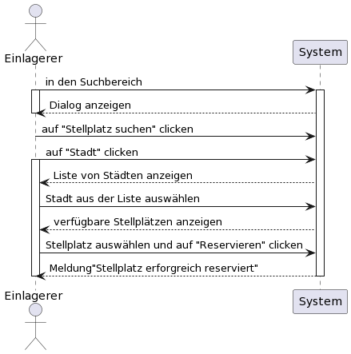
 
# StR.E.7
 Zusätzliches Angebot buchen 
  
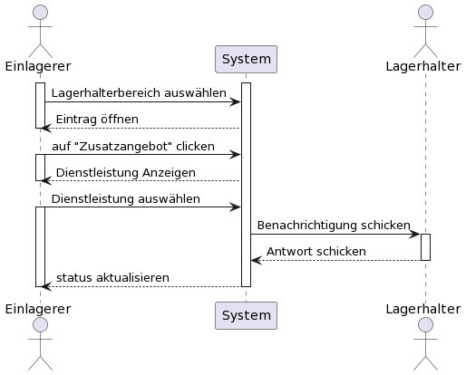
 
# StR.L.1
Lagerhalter Konto anlegen
 
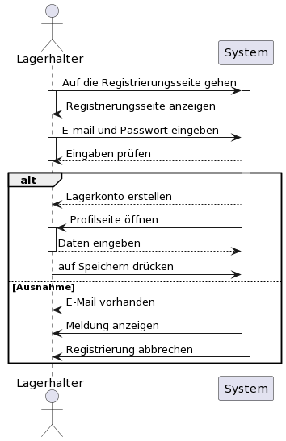
 
# StR.L2
Einlagerungsservices anbieten
 
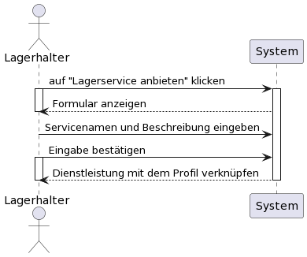
 
# StR.L3
Kapazitäten angeben
 
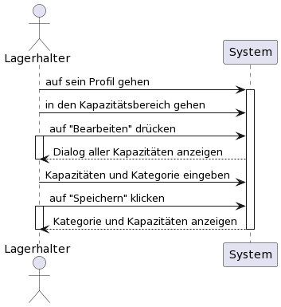
 
# StR.L4
Spezialgebiet angeben
 
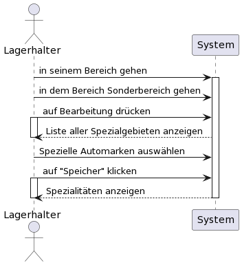
 
# StR.L6
Reparaturanfragen an Werkstätten einstellen
 
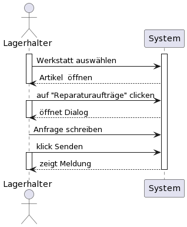
 
# StR.L7
Termin mit Werkstatt vereinbaren
 
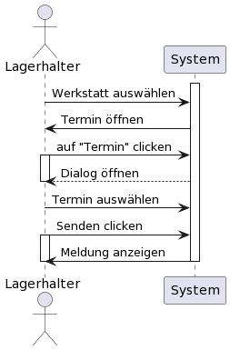
 
# StR.EA.1
Ersatzteilhandler Konto anlegen
 
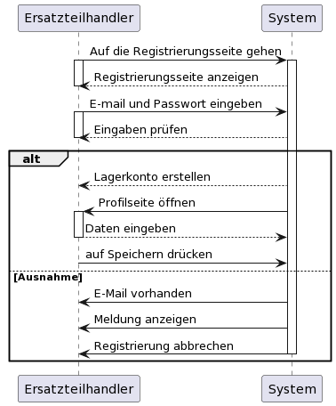
 
# StR.W.1
Werkstatt Konto anlegen
 
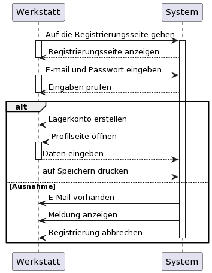
 
# StR.W.2
Werkstattservice anbieten
 
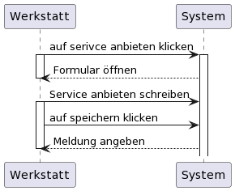

# Domänenmodell

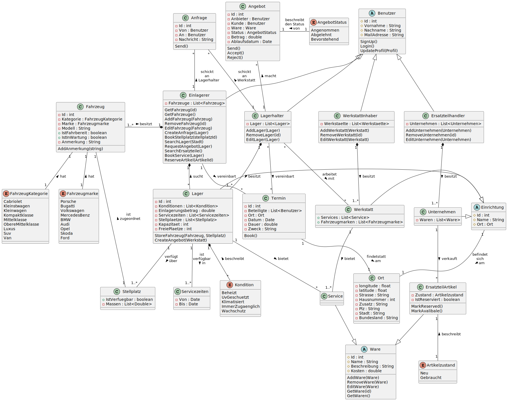

# UI Entwurf

#

 

# Interaktionsdiagramm OOD
Einlager Konto anlegen
 
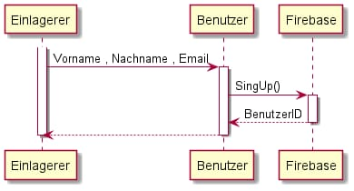
 

Termin vereinbaren (Lagerhalter und Einlagerer)
 
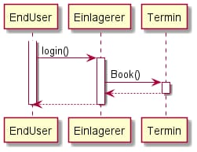
 

Lagerhalter Konto anlegen
 
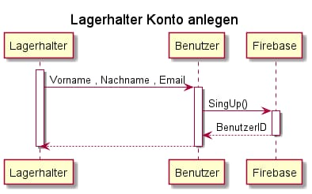
 

Einlagerungsservice anbieten
 
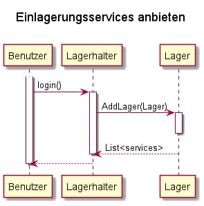
 

Kapazitäten angebn
 
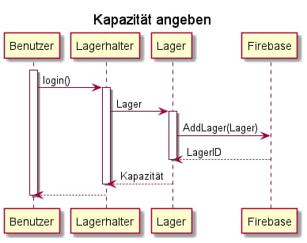
 

Spizailgebiet angeben
 
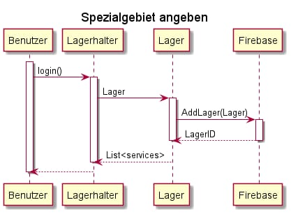

